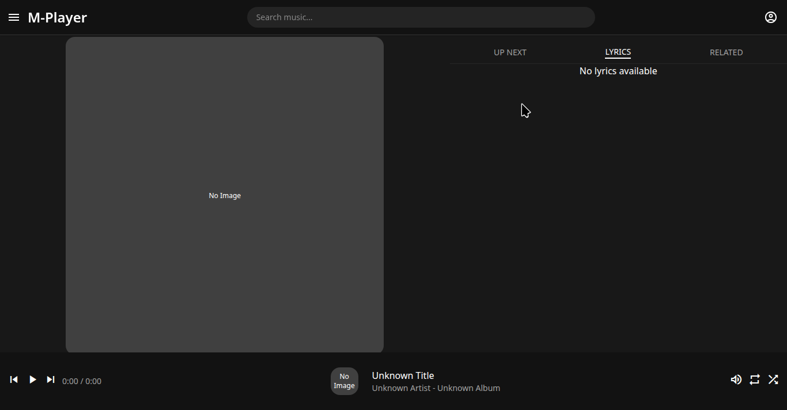

# M-Player
A music player developed with Electron, React and Vite. Based on YouTube Music.



## Setup

```sh
# clone the project
git clone https://github.com/IgnacioVeiga/M-Player.git

# enter the project directory
cd M-Player

# install dependency
npm install

# develop
npm run dev

# build executable
npm run build
```

## Directory structure
```tree
├── electron                                 Electron-related code
│   ├── main                                 Main-process source code
│   └── preload                              Preload-scripts source code
│
├── release                                  Generated after production build, contains executables
│   └── {version}
│       ├── {os}-{os_arch}                   Contains unpacked application executable
│       └── {app_name}_{version}.{ext}       Installer for the application
│
├── public                                   Static assets
└── src                                      Renderer source code, your React application
```

### Reference
https://github.com/electron-vite/electron-vite-react/